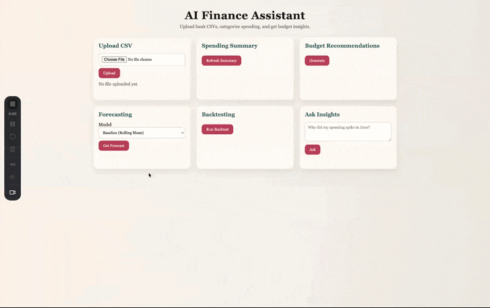

# AI Finance Assistant



AI-powered personal finance assistant for uploading bank CSVs, categorizing transactions, forecasting spending, and getting budget recommendations.

## Setup

```bash
python3 -m venv .venv
source .venv/bin/activate
pip install -r requirements.txt
```

## Run

```bash
uvicorn app.main:app --reload
```

Open http://127.0.0.1:8000 to use the frontend.

## Docker (Local)

```bash
docker-compose up --build
```

This runs the API on http://127.0.0.1:8000 with SQLite persisted in `./data`.

## Deployment Guides

- `DEPLOY_RENDER.md`
- `DEPLOY_RAILWAY.md`
- `DEPLOY_AWS.md`

## API Routes Overview

- `POST /upload` - Upload CSV file
- `GET /transactions` - List transactions (query: `category`, `start_date`, `end_date`)
- `GET /transactions/summary` - Totals and category/month summaries
- `GET /categories` - List categories
- `POST /categories/map` - Add keyword-to-category override
- `GET /recommendations` - Budget recommendations (optional `forecast_model`)
- `POST /insights/query` - Natural-language insights
- `POST /labels/correct` - Store a user correction and update transaction category
- `GET /labels/uncertain` - Fetch low-confidence predictions for review
- `GET /forecast` - Forecast next-month spend (query: `month`, `horizon`, `model`, `force`)
- `GET /forecast/models` - List available forecasting models
- `POST /forecast/backtest` - Run walk-forward backtesting
- `POST /model/train` - Train ML categorizer
- `POST /model/evaluate` - Evaluate ML categorizer
- `GET /mlops/registry` - List model versions
- `GET /mlops/runs` - List experiment runs
- `POST /mlops/promote` - Promote a version to production
- `GET /mlops/production` - Show production model pointers

## CSV Format

Supported headers:

- required: `date`, `description`, `amount`
- optional: `category`

Amounts should be negative for expenses and positive for income. If your CSV uses an explicit transaction type, the uploader will attempt to normalize debit/credit signs.

## Screenshot Instructions

1. Start the server.
2. Visit http://127.0.0.1:8000
3. Upload `sample_data/sample_transactions.csv`.
4. Click "Refresh Summary" and "Generate" to see results.

## Train the Model

1. Upload a CSV with category labels.
2. Train:

```bash
curl -X POST http://127.0.0.1:8000/model/train
```

3. Evaluate:

```bash
curl -X POST http://127.0.0.1:8000/model/evaluate
```

Model artifacts are saved under `models/` (legacy) and `models_registry/` for versioned runs.

## Forecasting Models

Available model names:

- `baseline_rolling_mean` - last-3-month rolling mean
- `sarima` - statsmodels SARIMAX (seasonal if >= 24 months)
- `prophet` - Prophet with yearly seasonality (optional)
- `lightgbm` - ML regression (LightGBM if available; fallback to XGBoost or sklearn HGB)

If a requested model is unavailable or has insufficient data, the API falls back to the baseline model unless `strict=true` is passed to `/forecast`.

## MLOps: Experiments and Model Versioning

Each training/backtest run is logged as an experiment with:

- dataset hash + snapshot metadata
- params + metrics JSON
- versioned artifacts under `models_registry/`

Versioning uses `v0001`, `v0002`, etc. Promoting a version sets it as the production default.

### Promote a Model Version

```bash
curl -X POST http://127.0.0.1:8000/mlops/promote \\
  -H "Content-Type: application/json" \\
  -d '{\"model_family\":\"categorizer\",\"model_name\":\"tfidf_logreg\",\"version\":\"v0001\"}'
```

### List Model Registry and Runs

```bash
curl \"http://127.0.0.1:8000/mlops/registry?model_family=categorizer\"
```

```bash
curl \"http://127.0.0.1:8000/mlops/runs?model_family=forecast&limit=10\"
```

### Check Production Pointers

```bash
curl http://127.0.0.1:8000/mlops/production
```

## Backtesting

Run walk-forward backtesting across top categories:

```bash
curl -X POST http://127.0.0.1:8000/forecast/backtest \
  -H "Content-Type: application/json" \
  -d '{"models":["baseline_rolling_mean","sarima","lightgbm"],"top_k_categories":10,"min_train_months":6}'
```

## Example curl commands

```bash
curl -X POST -F "file=@sample_data/sample_transactions.csv" http://127.0.0.1:8000/upload
```

```bash
curl http://127.0.0.1:8000/transactions/summary
```

```bash
curl http://127.0.0.1:8000/forecast/models
```

```bash
curl "http://127.0.0.1:8000/forecast?model=sarima&horizon=1"
```

```bash
curl -X POST http://127.0.0.1:8000/forecast/backtest \
  -H "Content-Type: application/json" \
  -d '{"models":["baseline_rolling_mean","sarima"],"top_k_categories":10,"min_train_months":6}'
```

```bash
curl http://127.0.0.1:8000/mlops/registry?model_family=categorizer
```

```bash
curl -X POST http://127.0.0.1:8000/mlops/promote \
  -H "Content-Type: application/json" \
  -d '{"model_family":"categorizer","model_name":"tfidf_logreg","version":"v0001"}'
```

```bash
curl http://127.0.0.1:8000/mlops/production
```

```bash
curl -X POST http://127.0.0.1:8000/insights/query \
  -H "Content-Type: application/json" \
  -d '{"question": "Why did my spending spike in June?"}'
```

## Optional OpenAI Summary Refinement

If you set `OPENAI_API_KEY`, the insights summary will be refined using an LLM (if the `openai` package is installed).

```bash
pip install openai
export OPENAI_API_KEY=your_key
```

## Pandas Warning Note

Pandas may warn that `pyarrow` will become a required dependency in a future major release. This does not affect current functionality; you can ignore it or install `pyarrow` if desired.

## Optional Forecasting Libraries

`prophet` and `lightgbm` are optional. If they are not installed or cannot run on your system, the API will automatically fall back to the baseline model (or to XGBoost/sklearn for the ML model).

On macOS, these optional wheels are not installed by default in `requirements.txt` to keep setup reliable. If you want them:

- `lightgbm` may require `libomp` (Homebrew: `brew install libomp`), then `pip install lightgbm`
- `prophet` can be installed with `pip install prophet`

## Optional MLflow Integration

If `mlflow` is installed and `USE_MLFLOW=true` with `MLFLOW_TRACKING_URI` set, experiment runs will also be logged to MLflow (the SQLite logs remain the source of truth).
